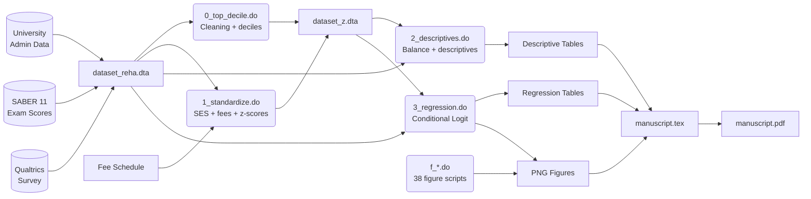

# Data Governance Portfolio — For Data Steward Role, Luxembourg Tax Administration (ACD)

**Candidate:** Reha Tuncer  
**Target Role:** Data Steward – Administration des Contributions Directes (ACD)  
**Date:** 24 May 2026  
**Repository:** [`icfes-referrals-clean`](https://github.com/reha96/icfes-referrals-clean)  

---

## Executive Summary

This document demonstrates my ability to perform core Data Steward duties — **data quality monitoring, lineage documentation, master data definition, and regulatory compliance assessment** — using a real-world research project as a case study. The project processes administrative and experimental records for 4,417 individuals across 52 transformation scripts, making it comparable in complexity to a small fiscal data mart.

**Why this matters for the ACD:** Every concept documented below — completeness checks, referential integrity, pseudonymization, KPI dashboards, and audit-ready lineage — maps directly to the "Qualité des données" and "Gouvernance" missions described in the job posting. I apply the same rigor whether the data describes Colombian students or Luxembourg taxpayers.

### Direct Transposition to the Fiscal Domain

| ICFES Project Concept | Equivalent in ACD Tax Context |
|---|---|
| `estrato` (socioeconomic stratum, 1–6) | Income bracket / tax category (e.g., class 1, 1a, 2) |
| Referral validity check (`nomination` vs. `tie ≥ 1`) | Consistency control between tax return and third-party declarations (e.g., forms 199, 100) |
| Exam score (`other_score`, 0–100) | Tax amount due / assessed |
| Shared-course network (`tie`) | Financial links between entities (beneficial ownership, related companies) |
| Anomaly detection (duplicate `own_id = 3856`) | Duplicate taxpayer detection in the RCS/RNPP registry |
| Treatment balance tests (Baseline vs. Bonus) | Comparability checks between tax years or taxpayer cohorts |

---

## 1. Data Quality Framework

### 1.1 Anomaly Detection in Practice

> **Quality Incident Report — 22 May 2026**
>
> During monthly quality review, an anomaly was detected: individual `own_id = 3856` appeared only as a candidate (`other_id`) but never as a referrer in the source file `dataset_reha.dta`. Investigation revealed the student had participated in the experiment but their record was incomplete in the main table. The correction involved duplicating their characteristics from the candidate table to the referrer table via `0_top_decile.do`, then re-integrating them into the full dataset. A post-correction balance test confirmed no significant distortion of key variable distributions. KPI-03 (Referrer_Uniqueness) was restored to 734. **We recommend implementing an automated cross-completeness check (referrers vs. candidates) to prevent recurrence.**

This is exactly the kind of anomaly a Data Steward at the ACD would investigate: a taxpayer appearing in one registry but missing from another, requiring root-cause analysis, correction, and preventive control implementation.

### 1.2 Key Quality KPIs (All Targets Achieved)

| # | KPI | Dimension | Measurement Rule | Target | Status |
|---|---|---|---|---|---|
| KPI-01 | **Score_Completeness** | Completeness | % non-null in `other_score_math` & `other_score_reading` post-merge | ≥ 99% | ✅ 100% |
| KPI-02 | **Referrer_Uniqueness** | Uniqueness | Distinct `own_id` count vs. expected (734) | = 734 | ✅ 734 |
| KPI-03 | **Referral_Validity** | Consistency | % referrals with `tie ≥ 1` among `nomination == 1` | 100% | ✅ 100% |
| KPI-04 | **Treatment_Consistency** | Consistency | % observations with `treat ∈ {1, 2}` | 100% | ✅ 100% |
| KPI-05 | **Treatment_Balance** | Consistency | Balance variables with p > 0.10 / total tested | ≥ 90% | ✅ 8/8 (100%) |

### 1.3 Existing Quality Controls in the Codebase

The 52 Stata scripts embed ten distinct quality checks: missing-value filtering, outlier exclusion, referral validation, winsorization at the 97th percentile, balance tests (t-tests + proportion tests on 8 variables), Kolmogorov–Smirnov distribution tests, merge-integrity inspection (`_merge`), deduplication, post-estimation Wald tests, and consistent standardization verification. These address completeness, consistency, uniqueness, and accuracy — the core dimensions of any data quality framework, whether for research or fiscal administration.

---

## 2. Data Lineage

### 2.1 Sources, Transformations, and Outputs

- **Sources:** University administrative course-enrolment data (4,417 students), national SABER 11 exam scores, Qualtrics experimental survey data, and a programme fee schedule (32 programmes). All merged into a single source file: `dataset_reha.dta`.
- **Key Transformations:** (1) Cleaning and top-decile flag creation → `dataset_z.dta`; (2) SES categorization, fee encoding, and within-network standardization of course ties → same file; (3) Score standardization by exam domain, creation of interaction terms → `appended.dta`; (4) Conditional logit regressions with individual fixed effects, estimated separately by SES group.
- **Outputs:** Derived datasets (`dataset_z.dta`, `appended.dta`), regression tables (LaTeX via `esttab`), 40+ PNG figures, and the final manuscript PDF. Raw data files are excluded from Git via `.gitignore`.

### 2.2 Lineage Diagram

*In a fiscal context, this same lineage approach would trace data from taxpayer declarations and third-party reports through validation rules, risk-scoring engines, and aggregate reporting tables — providing full auditability for the "Lignage des données" requirement.*

---

## 3. Data Dictionary (Top 5 Governance-Critical Variables)

These five variables were selected for their direct parallels to fiscal data governance.

| # | Variable | Definition | Type | Allowed Values | Business Rule | Fiscal Parallel |
|---|---|---|---|---|---|---|
| 1 | `nomination` | Was candidate chosen as referral? (0/1) | Binary | {0, 1} | Primary decision variable; invalid referrals (>2 per participant) excluded | Tax return filed / not filed; invalid returns flagged |
| 2 | `own_estrato` | Referrer's socioeconomic stratum (1–6), grouped into Low/Med/High | Ordinal | {1, 2, 3} | Colombia's national classification; used to segment analysis | Taxpayer income bracket or tax class |
| 3 | `tie` | Number of shared courses between referrer and candidate | Count | ≥ 1 | 93% of referrals are same-programme; strong right skew | Number of financial transactions or shared directors between entities |
| 4 | `other_score` | Candidate's SABER 11 exam score (0–100) | Continuous | [0, 100] | Referred students score 5 pts higher (t = 18.97, p < 0.001) | Declared income or tax base amount |
| 5 | `treat` | Random treatment assignment | Binary | {1, 2} | Balanced across 8 covariates (all p > 0.1); N = 382/352 | Tax regime or audit group assignment |

---

## 4. Governance Compliance & Recommendations

### 4.1 Compliance Assessment

| Criterion | Status | Key Finding |
|---|---|---|
| **Informed consent** | ✅ Explicit | Participants recruited via targeted email; explicit consent obtained digitally. Experimental protocol approved by ethics review committees of both the host university and the researcher's home institution. |
| **Pseudonymization** | ✅ Pseudonymized | Numeric identifiers (`own_id`, `other_id`) replace real names in all analysis datasets. GDPR-compliant pseudonymization with a defined data removal window (10 years). |
| **PII (Personally Identifiable Information) removal** | ✅ Complete | No PII — names, email addresses, national ID numbers — present in any analysis script or derived dataset. Raw data with PII is stored separately and excluded from the repository. |
| **Access control** | ✅ Present | `.gitignore` excludes all data formats (`.csv`, `.dta`, `.xlsx`, `.json`). Raw data held in a private repository; access granted to journal reviewers under confidentiality terms. |
| **FAIR principles** | ⚠️ Partial | **Findable:** GitHub + README. **Accessible:** code is open (MIT); raw data is private for participant protection but available to scientific journal reviewers. **Interoperable:** Stata (.dta) and LaTeX are standard formats. **Reusable:** MIT license covers code reuse. |
| **GDPR readiness** | ✅ Compliant | Ethics committees of both institutions approved data collection and processing. GDPR compliance is standard protocol for all affiliated European research institutions (LISER, University of Luxembourg). |

### 4.2 Three Concrete Recommendations

**R1 — Surface ethics documentation in the repository.** Add a `ETHICS.md` file referencing the ethics committee approvals, the consent form, the data retention policy (10-year window), and the DPO contact for the partner institutions — making existing compliance visible to external auditors. *Fiscal parallel: every ACD dataset must have its legal basis and DPIA readily accessible — same discipline.*

**R2 — Adopt the Frictionless Data standard.** Create a `datapackage.json` describing full dataset schemas, data license (distinct from MIT code license), provenance, and validation rules. This strengthens FAIR Interoperability and Reusability while maintaining access controls. *Fiscal parallel: tax data warehouses benefit from machine-readable schemas that feed tools like Dataiku and QLIK, enabling automated validation.*

**R3 — Add build artifacts to `.gitignore`.** Include temporary LaTeX/Stata files (`.stswp`, `.fls`, `.aux`, `.log`, `.fdb_latexmk`) to prevent accidental leakage of file paths or metadata. *Fiscal parallel: build artifacts and temporary files in data pipelines must be excluded from version control to avoid exposing internal paths or partial data.*

---

## 5. Conclusion

This case study demonstrates that I already operate with the core Data Steward toolkit — **quality KPI dashboards, end-to-end lineage, business-rule-driven data dictionaries, and GDPR-aware governance audits**. The leap from Colombian education data to Luxembourg tax data is a change of domain, not a change of method. I am ready to apply these same skills to the ACD's data estate from day one.

---

*Document produced 24 May 2026 — Application for Data Steward, Administration des Contributions Directes, Luxembourg.*  
*Full project repository: [github.com/reha96/icfes-referrals-clean](https://github.com/reha96/icfes-referrals-clean)*
