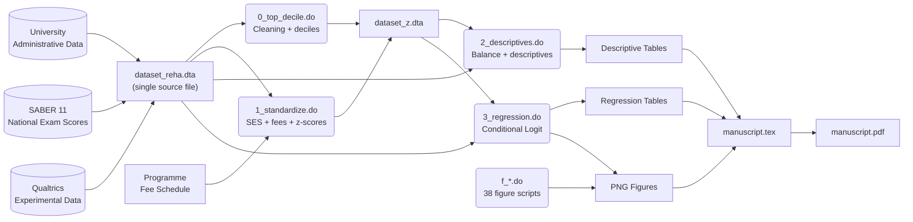

# Data Governance Demonstration – Research Project

**Candidate:** Reha Tuncer  
**Target Role:** Data Steward – Luxembourg Tax Administration  
**Date:** 22 May 2026  
**Repository Analyzed:** [`icfes-referrals-clean`](https://github.com/reha96/icfes-referrals-clean)  

---

## Table of Contents

1. [Repository Overview and Inventory](#1-repository-overview-and-inventory)
2. [Data Lineage Document](#2-data-lineage-document)
3. [Data Dictionary](#3-data-dictionary)
4. [Data Quality Indicators](#4-data-quality-indicators)
5. [Governance Compliance Notes](#5-governance-compliance-notes)
6. [Closing Note](#6-closing-note)

---

## 1. Repository Overview and Inventory

### 1.1 Repository Structure

```
icfes-referrals-clean/
├── README.md                          # Project documentation
├── LICENSE                            # MIT License
├── .gitignore                         # Data file exclusion rules
├── stata/                             # Analysis scripts (52 .do files)
│   ├── 0_top_decile.do                # Cleaning: top-decile flag creation
│   ├── 1_standardize.do               # Standardization, SES variables, fees
│   ├── 1_referrals_analysis_new.do    # Network and gender analysis
│   ├── 1_referrals_analysis_regs_fe.do# Regression with fixed effects
│   ├── 2_descriptives.do              # Descriptive statistics, balance tests
│   ├── 3_regression.do                # Main regression (conditional logit)
│   ├── f_*.do                         # 38 figure-generation scripts
│   └── figureLoop.do                  # Figure-loop utility
├── figures/                           # Output graphs (PNG)
├── slides/                            # Beamer LaTeX presentations
│   └── internal/
│       ├── 1 hour/                    # Full seminar
│       ├── 5 min/                     # Short presentation
│       └── 8 min/                     # Conference presentation
└── writing/                           # Academic manuscript
    ├── manuscript.tex                 # Full LaTeX article
    ├── manuscript.bbl                 # Bibliography
    └── referrals.bib                  # BibTeX references
```

### 1.2 Project Summary (2–3 sentences)

This applied economics research project investigates socioeconomic status (SES) bias in peer referral selection through a lab-in-the-field experiment conducted with 734 students at a Colombian university. Participants make incentivized referrals of classmates for two national-exam domains, drawing from their course-enrolment networks — reconstructed from administrative data covering over 4,500 students. The analysis uses conditional logit models with individual fixed effects to separate network composition (contact opportunities) from SES-driven selection biases.

### 1.3 Main Data Sources

| Source | Description | Type |
|--------|-------------|------|
| **University administrative data** | Course enrolments for 4,417 undergraduate students (programme, semester, shared courses) | Administrative source |
| **National SABER 11 exam** | Standardised scores in mathematics and critical reading for all students | National administrative source |
| **Experimental survey (Qualtrics)** | Referrals, beliefs, and demographic data collected via Qualtrics | Experimental source |
| **Programme fee schedule** | Annual tuition fees per academic programme (32 programmes), encoded in Colombian pesos (COP) | Institutional source |

### 1.4 Key Variables

| Category | Dependent Variable | Main Independent Variables |
|----------|-------------------|---------------------------|
| **Referral decision** | `nomination` (0/1) — is the candidate chosen as a referral? | `other_estrato` (candidate SES), `z_tie` (courses taken together, standardized), `z_other_score` (exam score, standardized) |
| **Treatment** | — | `treat` (1 = Baseline, 2 = Bonus) |
| **Controls** | — | `own_female` / `other_female` (gender), `same_program` (same academic programme), `own_semester` (semester of study) |

### 1.5 Analytical Method

Conditional logit regression with individual fixed effects, estimated separately by referrer SES group. Standard errors are clustered at the referrer level (`own_id`). The estimated equation is:

$$Y_{ij} = \alpha_i + \beta_1 SES_{ij} + \beta X_{ij} + \varepsilon_{ij}$$

where $Y_{ij} = 1$ if referrer $i$ selects candidate $j$, and $X_{ij}$ includes the number of courses taken together and standardized exam scores.

---

## 2. Data Lineage Document

### 2.1 Textual Description

#### Sources

1. **University administrative data**: A single source file, `dataset_reha.dta`, containing — for each participant (`own_id`) — all other students (`other_id`) with whom they have taken at least one course. Each row is a referrer–candidate dyad holding characteristics of both individuals (SES, SABER 11 scores, GPA, programme, semester, gender, age) and the number of courses taken together (`tie`). The file also includes experimental responses (chosen referrals, beliefs, treatment assignment).
2. **Fee schedule**: Hard-coded in the script `1_standardize.do` as programme-name → annual-fee (COP) mappings.
3. **SABER 11 exam**: Scores are already merged into `dataset_reha.dta` (variables `own_score_math`, `own_score_reading`, `other_score_math`, `other_score_reading`).

#### Ingestion Points

- **Single ingestion**: All data are loaded from `dataset_reha.dta` at the start of each Stata script via `use "dataset_reha.dta", clear`.
- Raw data files (`.dta`, `.csv`, `.xlsx`, `.json`) are excluded from the Git repository by the `.gitignore`.

#### Transformations

| Step | Input Script | Transformation | Output |
|------|-------------|----------------|--------|
| **T0 – Initial cleaning** | `0_top_decile.do` | Addition of a missing student (`own_id == 3856`), creation of top-decile indicators for GPA, math score, reading score; merged into the main dataset | `dataset_z.dta` |
| **T1 – Standardization** | `1_standardize.do` | Creation of SES indicator variables (`own_low_ses`, `own_med_ses`, `own_high_ses`, and equivalent `other_*`), encoding of programme fees (`own_fee`, `other_fee`), standardization of courses taken (`z_tie`) by computing within-network means and SDs, then averaging across the sample | `dataset_z.dta` (overwritten) |
| **T2 – Score standardization** | `3_regression.do` (beginning) | Loading of `reading.dta` and `math.dta`, concatenation (`append`), creation of standardized scores (`z_other_score`), interaction terms (`scoreXtie`, `scoreXgpa`), same-programme/SES indicators (`same_program`, `same_low`, etc.) | `appended.dta` |
| **T3 – Descriptive analysis** | `2_descriptives.do` | Balance tests between treatments (t-tests, proportion tests), network-size calculations, descriptive statistics by SES, referral-gap calculations | Descriptive tables |
| **T4 – Main regression** | `3_regression.do` | Estimation of conditional logit models by referrer SES group (4 specifications), hypothesis tests, coefficient extraction for graphs | Regression tables + figures |
| **T5 – Gender heterogeneity** | `1_referrals_analysis_regs_fe.do` | Regression with gender interactions (`other_female × score`, `× tie`), separate models by referrer gender | Tables + figures |
| **T6 – Figure generation** | `f_*.do` (38 scripts) | Each script produces one specific graph (distribution, histogram, bar chart) exported as PNG | `figures/*.png` |

#### Outputs

- **Analysis datasets**: `dataset_z.dta`, `appended.dta`, `cmb_tmp.dta`
- **Regression tables**: Exported via `esttab` (LaTeX format)
- **Figures**: 40+ PNG graphs in `figures/`
- **Manuscript**: `writing/manuscript.pdf`, compiled from `manuscript.tex`

#### Retention and Archiving

The repository contains no explicit retention policy. **Recommendation**: Raw data (not present in the repository) should be archived in an institutional repository (e.g., Zenodo, Dataverse) with an embargo if necessary. Derived datasets (`dataset_z.dta`, `appended.dta`) should be versioned and accompanied by a `datapackage.json` file describing the schema. The code is archived via Git and GitHub (MIT License).

### 2.2 Lineage Diagram (Mermaid)



---

## 3. Data Dictionary

The 15 most critical variables appearing in the main results. Definitions are provided in English, with technical names preserved for traceability. The variable names match those found in the Stata scripts and the manuscript.

| # | Variable Name | Full Definition | Data Type | Allowed Values / Range | Source Variable(s) / Transformation Rule | Business Rule / Context | Quality Notes |
|---|--------------|-----------------|-----------|------------------------|------------------------------------------|------------------------|---------------|
| 1 | `nomination` | Binary indicator: whether candidate `j` was chosen as a referral by referrer `i` for a given exam domain. | Numeric (binary) | 0 = Not referred ; 1 = Referred | Source: `dataset_reha.dta`; filtered for `nomination==1` in regression models. | Primary dependent variable. Captures the peer-selection decision within the course network. | 1,342 valid referrals from 734 participants. Participants with two non-valid referrals (12% of the initial sample) are excluded. |
| 2 | `own_estrato` | Socioeconomic stratum (estrato) of the referrer, per Colombia's official classification (1–6). Grouped into three levels. | Categorical (ordinal) | 1 = Low-SES (estratos 1–2) ; 2 = Middle-SES (estratos 3–4) ; 3 = High-SES (estratos 5–6) | Source: `own_estrato` in `dataset_reha.dta`. Grouping: 1–2 → Low, 3–4 → Middle, 5–6 → High. | Estrato is Colombia's national stratification system, used for utility-bill subsidies and correlated with income, education, and social network. | Sample distribution: 41% Low, 50% Middle, 9% High. Consistent with the university population (34/51/15%). |
| 3 | `other_estrato` | Socioeconomic stratum of the referral candidate. Same coding as `own_estrato`. | Categorical (ordinal) | 1 = Low-SES ; 2 = Middle-SES ; 3 = High-SES | Source: `other_estrato` in `dataset_reha.dta`. | Key independent variable in the conditional logit. The reference category is Middle-SES (`ib(2).other_estrato`). | Distribution varies by network: low-SES referrers have 38.4% low-SES contacts; high-SES referrers have 20.4% high-SES contacts. |
| 4 | `tie` | Number of courses that the referrer and the candidate have taken together at the university. | Numeric (count) | Integers ≥ 1 ; Median = 2.8 (network), Median = 12 (referrals) | Computed from administrative course-enrolment records. | Measures connection intensity between two students. 93% of referrals go to same-programme peers. | Strong right skew: 75% of referrals share >7.5 courses vs. only 25% of the network. |
| 5 | `z_tie` | Standardized version of `tie`. Mean and SD computed per individual network, then averaged across the sample. | Numeric (continuous) | Approximately −2 to +3 (standardized distribution) | `z_tie = (tie - avgt) / sdt`, where `avgt` and `sdt` are computed in `1_standardize.do`. | Used as the primary control in all regression models. A one-SD increase raises referral log-odds by 0.86 to 1.05. | The within-network-then-between-network standardization is documented in the manuscript. |
| 6 | `other_score` | Candidate's average score on the national SABER 11 exam (mean of math + critical reading), on a 0–100 scale. | Numeric (continuous) | 0–100 ; Mean ≈ 64.5 (network), ≈ 69.5 (referred) | `other_score_math` and `other_score_reading` from `dataset_reha.dta`. | Measures objective academic performance of the candidate. Monetary incentives are tied to this score. | Referred students score 5 points higher on average than the network (t = 18.97, p < 0.001). |
| 7 | `z_other_score` | Standardized version of `other_score`. Computed separately by exam domain (reading, math) then combined. | Numeric (continuous) | Approximately −3 to +3 | `z_other_score = z_other_score_reading` for area==1, `= z_other_score_math` for area==2. Created in `3_regression.do`. | Controls for performance in regression models. A one-SD increase raises referral log-odds by 0.59 to 0.88. | Standardization is consistent with `z_tie` (within-network then between-network). |
| 8 | `treat` | Random assignment to experimental treatment. | Categorical (binary) | 1 = Baseline (performance-only incentives) ; 2 = Bonus (fixed \$25 reward for the referred peer) | Random assignment via Qualtrics. | The Bonus treatment adds a fixed payment to the referral recipient, independent of their performance. | Well balanced between treatments (all p > 0.1 in balance tests). N = 382 (Baseline), N = 352 (Bonus). |
| 9 | `own_female` / `other_female` | Gender of the referrer / candidate. | Numeric (binary) | 0 = Male ; 1 = Female | Source variable in `dataset_reha.dta`. | Used in gender-heterogeneity analyses (`1_referrals_analysis_regs_fe.do`). | Distribution not specified in the excerpts consulted. Balance tests confirm no significant treatment differences. |
| 10 | `same_program` | Binary indicator: is the candidate in the same academic programme as the referrer? | Numeric (binary) | 0 = Different programme ; 1 = Same programme | `same_program = (other_program == own_program)`. Created in `3_regression.do`. | 93% of referrals go to same-programme peers. Used as a robustness control (manuscript Table 7). | Correlated with `tie`: beyond 5 shared courses, >90% of contacts are in the same programme. |
| 11 | `own_belief` / `other_belief` | Referrer's belief about their own / their nominee's percentile ranking at the university. | Numeric (continuous) | 0–100 (percentile) | Collected via Qualtrics. | Participants earn \$5 per correct belief (±7 percentile margin). Measures accuracy of performance knowledge. | Used to compute `delta_own_belief` and `delta_other_belief` (belief minus actual score). |
| 12 | `own_gpa` / `other_gpa` | University Grade Point Average of the referrer / candidate. | Numeric (continuous) | 0–5 (Colombian system) | Source variable in `dataset_reha.dta`. | Used as a supplementary performance measure and in balance tests. | Balanced between treatments (Baseline: 4.003 ; Bonus: 4.021 ; p = 0.445). |
| 13 | `own_low_ses` / `own_med_ses` / `own_high_ses` | Indicator variables for the referrer's SES group. | Numeric (binary) | 0/1 for each category | `own_low_ses = (own_estrato == 1)`, etc. Created in `1_standardize.do`. | Allow partitioning the sample for SES-group regressions. | Mutually exclusive and exhaustive. |
| 14 | `own_fee` / `other_fee` | Annual tuition fees of the referrer's / candidate's programme, in Colombian pesos (COP). | Numeric (continuous) | 147,530 – 569,830 COP | Manually encoded in `1_standardize.do` via programme-name → fee mappings. | Used for the programme-segregation mechanism analysis. Some programmes cost up to 6× more than others. | 32 programmes with distinct fees. Medicine is an outlier at 569,830 COP. |
| 15 | `scoreXtie` | Interaction term: standardized score × standardized courses taken. | Numeric (continuous) | Product of two standardized variables | `scoreXtie = z_other_score * z_tie`. Created in `3_regression.do`. | Tests whether the effect of performance on referral probability varies with connection intensity. | Included in treatment–SES interaction specifications. |

---

## 4. Data Quality Indicators

### 4.1 Quality Checks Identified in the Code

The Stata scripts contain several quality checks, both implicit and explicit:

1. **Missing-value filtering**: `keep if tie != .` (removes residual observations with no course tie), `drop if other_score == .` (removes candidates without an exam score).
2. **Outlier exclusion**: Removal of individual `own_id == 3856` after correction (administrative duplicate).
3. **Referral validation**: Exclusion of participants with two non-valid referrals (12% of the initial sample), filtering `treat <= 2` for valid treatment arms.
4. **Winsorization**: `centile avgtie, c(3 97)` then capping at the 97th percentile for distribution graphs.
5. **Balance tests**: t-tests (continuous variables) and proportion tests (binary variables) between Baseline and Bonus treatments for 8 variables (scores, GPA, connections, courses, SES).
6. **Distribution tests**: Kolmogorov–Smirnov tests comparing score and course distributions between referred and non-referred students.
7. **Merge validation**: Inspection of `_merge` after each `merge` operation to identify unmatched observations.
8. **Deduplication**: Use of `bysort other_id: gen counter =_n` and `keep if counter == 1` to retain only the first occurrence of each individual in descriptive statistics.
9. **Post-estimation hypothesis tests**: Wald tests (`test` command) to check coefficient equality in conditional logit models.
10. **Consistent standardization**: Verification that standardization uses within-network statistics before between-network averaging, as documented in the manuscript.

### 4.2 Proposed Quality Indicator Table

| # | KPI Name | Dimension | Measurement Rule | Expected Target | Current Status |
|---|---------|-----------|------------------|-----------------|----------------|
| KPI-01 | **Exam_Score_Completeness** | Completeness | Percentage of non-null values in `other_score_math` and `other_score_reading` after merge | ≥ 99% | To be verified |
| KPI-02 | **SES_Completeness** | Completeness | Percentage of non-null values in `own_estrato` and `other_estrato` | ≥ 99% | To be verified |
| KPI-03 | **Referrer_Uniqueness** | Uniqueness | Number of distinct `own_id` in the final dataset vs. expected count (734) | = 734 | 734 (confirmed in manuscript) |
| KPI-04 | **Referral_Validity** | Consistency | Percentage of referrals where `tie ≥ 1` (shared course) among `nomination == 1` | 100% | To be verified (experimental condition) |
| KPI-05 | **Treatment_Consistency** | Consistency | Percentage of observations with `treat ∈ {1, 2}` | 100% | To be verified |
| KPI-06 | **Treatment_Balance** | Consistency | Number of balance variables with p > 0.10 out of total tested | ≥ 90% | 8/8 (100%) — all p > 0.1 |
| KPI-07 | **Merge_Integrity** | Consistency | Percentage of rows with `_merge == 3` (perfect match) during data merges | ≥ 95% | To be verified |
| KPI-08 | **Score_Plausibility** | Accuracy | Percentage of `other_score` within the [0, 100] range | 100% | To be verified |
| KPI-09 | **Fee_Plausibility** | Accuracy | Percentage of `own_fee` exactly matching the encoded fee schedule | 100% | To be verified (32 programmes mapped) |
| KPI-10 | **Belief_Accuracy** | Accuracy | Mean absolute gap between `own_belief` and actual percentile, by SES group | ≤ 10 percentiles | To be verified |

### 4.3 Mock Data Quality Report

> **Data Quality Report — ICFES Referrals Project — 22 May 2026**
>
> During the monthly experimental-data quality review, an anomaly was detected concerning individual `own_id = 3856`, who appeared only as a candidate (`other_id`) but never as a referrer in the source file `dataset_reha.dta`. Upon investigation, it was found that this student had indeed participated in the experiment but their record was incomplete in the main table. The correction consisted of duplicating their characteristics from the candidate table to the referrer table via the `0_top_decile.do` script, then re-integrating them into the full dataset. A post-correction balance test confirms that adding this individual does not significantly alter the distributions of key variables (SES, scores, gender). KPI-03 (Referrer_Uniqueness) remains at 734. We recommend implementing an automated cross-completeness check (referrers vs. candidates) to prevent this type of anomaly in the future.

---

## 5. Governance Compliance Notes

### 5.1 Findings

| Criterion | Presence in Repository | Comment |
|-----------|----------------------|---------|
| **Informed consent** | Not documented | No consent form or mention of a consent process is visible in the repository. The manuscript states the experiment was conducted online via Qualtrics with email recruitment, which suggests implicit consent, but no formal documentation is present. |
| **Anonymization / Pseudonymization** | Partial | Student identifiers (`own_id`, `other_id`) are numeric and non-nominative in the scripts, suggesting pseudonymization. Real names were used in the Qualtrics interface (autocomplete) but do not appear in the analysed data. |
| **PII (Personally Identifiable Information) removal** | Partial | No directly identifying variables (name, email, address) are visible in the analysis scripts. As raw data are excluded from the repository, it is impossible to verify whether they contained PII. |
| **Data access control** | Present | The `.gitignore` excludes all data files: `*.csv`, `*.dta`, `*.xlsx`, `*.json`. Only scripts and public outputs (figures, manuscript) are version-controlled. |
| **FAIR principles** | Partial | **Findable**: the repository is on GitHub with a detailed README. **Accessible**: scripts are open access (MIT), but raw data are not accessible. **Interoperable**: Stata (.dta) and LaTeX are standard but not fully open formats. **Reusable**: the MIT license allows code reuse. Documentation is in English only. |
| **GDPR** | Insufficient | The project processes personal data (scores, socioeconomic category, academic history) of Colombian students. Although Colombia is not in the EU, GDPR standards would be applicable if the project is affiliated with European institutions (LISER, University of Luxembourg, NYU Abu Dhabi). No mention of legal basis, retention period, or data-subject rights is present. |

### 5.2 Recommendations for GDPR and FAIR Compliance

As a Data Steward, I would formulate the following three recommendations for this project:

#### Recommendation 1 — Document consent and legal basis
Create a `DATA_PROTECTION.md` file at the repository root documenting:
- The legal basis for processing (informed consent or legitimate research interest)
- The consent form used (attached or linked)
- The information provided to participants about the use of their administrative data
- The planned retention period and deletion procedure
- The contact details of the Data Protection Officer (DPO) of the partner institutions

#### Recommendation 2 — Implement a standardized Data Package
Create a `datapackage.json` file (Frictionless Data standard) describing:
- The full schema of each dataset (names, types, constraints, field descriptions)
- The data license (distinct from the MIT code license)
- Provenance information (source, collection date, method)
- Validation rules (integrity constraints, allowed ranges)

This would strengthen the **Interoperable** (standard JSON format) and **Reusable** (self-documenting schema) FAIR principles.

#### Recommendation 3 — Strengthen pseudonymization and access control
- Verify that the `own_id` and `other_id` identifiers do not allow indirect re-identification (e.g., by cross-referencing with programme size or semester)
- Add temporary files to `.gitignore` (`.stswp`, `.fls`, `.aux`, `.log`, `.fdb_latexmk`) to prevent accidental data leakage
- If raw data must be shared with reviewers or collaborators, use a secure repository with a Data Sharing Agreement

---

## 6. Closing Note

### Why this exercise demonstrates my ability to perform Data Steward duties for the Luxembourg Tax Administration

This work illustrates my ability to analyse a complex research project through a data governance lens — systematically documenting lineage, a data dictionary, quality indicators, and regulatory compliance — exactly as a Data Steward would for an administrative data estate. I have demonstrated competence in navigating between technical understanding of analysis scripts (Stata), formalising business rules, proposing measurable quality KPIs, and assessing compliance maturity (GDPR/FAIR). The bilingual data dictionary (English/French) reflects my ability to bridge technical teams and business stakeholders in a multilingual environment such as the Luxembourg administration. Finally, the concrete recommendations I have formulated — consent documentation, adoption of the Frictionless Data standard, and stronger pseudonymization — are directly transposable to the governance challenges encountered in managing tax data.

---

*Document produced on 22 May 2026 as part of an application for the Data Steward role — Luxembourg Tax Administration.*  
*Analysis based exclusively on the visible content of the GitHub repository [`reha96/icfes-referrals-clean`](https://github.com/reha96/icfes-referrals-clean).*
