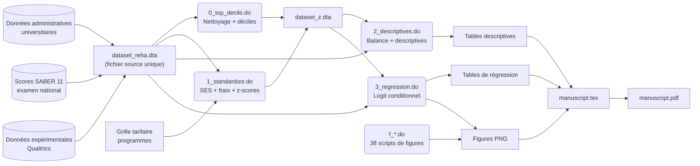

# Démonstration de Gestion des Données – Projet de Recherche

**Candidat :** Reha Tuncer  
**Poste visé :** Data Steward – Administration fiscale luxembourgeoise  
**Date :** 22 mai 2026  
**Référentiel analysé :** [`icfes-referrals-clean`](https://github.com/reha96/icfes-referrals-clean)  

---

## Table des matières

1. [Vue d'ensemble et inventaire du référentiel](#1-vue-densemble-et-inventaire-du-référentiel)
2. [Document de traçabilité des données (Data Lineage)](#2-document-de-traçabilité-des-données-data-lineage)
3. [Dictionnaire des données (Data Dictionary)](#3-dictionnaire-des-données-data-dictionary)
4. [Indicateurs de qualité des données](#4-indicateurs-de-qualité-des-données)
5. [Notes de conformité (Gouvernance)](#5-notes-de-conformité-gouvernance)
6. [Note de synthèse](#6-note-de-synthèse)

---

## 1. Vue d'ensemble et inventaire du référentiel

### 1.1 Structure du référentiel

```
icfes-referrals-clean/
├── README.md                          # Documentation du projet
├── LICENSE                            # Licence MIT
├── .gitignore                         # Exclusion des fichiers de données
├── stata/                             # Scripts d'analyse (52 fichiers .do)
│   ├── 0_top_decile.do                # Nettoyage : création des déciles
│   ├── 1_standardize.do               # Standardisation, variables SES, frais
│   ├── 1_referrals_analysis_new.do    # Analyse réseau et genre
│   ├── 1_referrals_analysis_regs_fe.do# Régression avec effets fixes
│   ├── 2_descriptives.do              # Statistiques descriptives, balance
│   ├── 3_regression.do                # Régression principale (logit conditionnel)
│   ├── f_*.do                         # 38 scripts de génération de figures
│   └── figureLoop.do                  # Utilitaire de boucle pour figures
├── figures/                           # Graphiques produits (PNG)
├── slides/                            # Présentations Beamer LaTeX
│   └── internal/
│       ├── 1 hour/                    # Séminaire complet
│       ├── 5 min/                     # Présentation courte
│       └── 8 min/                     # Présentation conférence
└── writing/                           # Manuscrit académique
    ├── manuscript.tex                 # Article complet en LaTeX
    ├── manuscript.bbl                 # Bibliographie
    └── referrals.bib                  # Références BibTeX
```

### 1.2 Résumé du projet (2-3 phrases)

Ce projet de recherche en économie appliquée étudie les biais de classe socio-économique (SES) dans la sélection de références (referrals) entre pairs, à travers une expérience de terrain menée auprès de 734 étudiants d'une université colombienne. Les participants effectuent des recommandations incitatives de leurs camarades pour deux domaines d'un examen national, à partir de leurs réseaux de cours — reconstitués via des données administratives couvrant plus de 4 500 étudiants. L'analyse utilise des modèles logit conditionnels avec effets fixes individuels pour séparer la composition du réseau (opportunités de contact) des biais de sélection liés au statut socio-économique.

### 1.3 Sources de données principales

| Source | Description | Type |
|--------|-------------|------|
| **Données administratives universitaires** | Inscriptions aux cours de 4 417 étudiants de premier cycle (programme, semestre, cours partagés) | Source administrative |
| **Examen national SABER 11** | Scores standardisés en mathématiques et lecture critique pour tous les étudiants | Source administrative nationale |
| **Enquête expérimentale (Qualtrics)** | Références, croyances (beliefs), données démographiques récoltées via Qualtrics | Source expérimentale |
| **Grille tarifaire des programmes** | Frais de scolarité annuels par programme académique (32 programmes), codés en pesos colombiens (COP) | Source institutionnelle |

### 1.4 Variables clés

| Catégorie | Variable dépendante | Variables indépendantes principales |
|-----------|---------------------|-------------------------------------|
| **Décision de référence** | `nomination` (0/1) — le candidat est-il choisi comme référence ? | `other_estrato` (SES du candidat), `z_tie` (nombre de cours partagés, standardisé), `z_other_score` (score examen, standardisé) |
| **Traitement** | — | `treat` (1 = Baseline, 2 = Bonus) |
| **Contrôles** | — | `own_female`/`other_female` (genre), `same_program` (même programme), `own_semester` (semestre d'études) |

### 1.5 Méthode analytique

Régression logit conditionnelle (*conditional logit*) avec effets fixes individuels, estimée séparément par groupe SES du référent. Les écarts-types sont clusterisés au niveau du référent (`own_id`). L'équation estimée est :

$$Y_{ij} = \alpha_i + \beta_1 SES_{ij} + \beta X_{ij} + \varepsilon_{ij}$$

où $Y_{ij} = 1$ si le référent $i$ choisit le candidat $j$, et $X_{ij}$ inclut le nombre de cours partagés et les scores d'examen standardisés.

---

## 2. Document de traçabilité des données (Data Lineage)

### 2.1 Description textuelle

#### Sources

1. **Données administratives universitaires** : Fichier source unique `dataset_reha.dta` contenant, pour chaque participant (`own_id`), l'ensemble des autres étudiants (`other_id`) avec lesquels il a partagé au moins un cours. Chaque ligne représente une dyade (référent-candidat) avec les caractéristiques des deux individus (SES, scores SABER 11, GPA, programme, semestre, genre, âge) et le nombre de cours partagés (`tie`). Le fichier contient également les réponses expérimentales (références choisies, croyances, traitement).
2. **Grille tarifaire** : Encodée directement dans le script `1_standardize.do` sous forme de correspondances nom de programme → frais annuels en COP.
3. **Examen SABER 11** : Scores déjà fusionnés dans `dataset_reha.dta` (variables `own_score_math`, `own_score_reading`, `other_score_math`, `other_score_reading`).

#### Points d'ingestion

- **Ingestion unique** : toutes les données sont chargées depuis `dataset_reha.dta` au début de chaque script Stata via la commande `use "dataset_reha.dta", clear`.
- Les fichiers de données brutes (`.dta`, `.csv`, `.xlsx`, `.json`) sont exclus du dépôt Git par le `.gitignore`.

#### Transformations

| Étape | Script d'entrée | Transformation | Sortie |
|-------|-----------------|---------------|--------|
| **T0 – Nettoyage initial** | `0_top_decile.do` | Ajout d'un étudiant manquant (`own_id == 3856`), création des indicateurs de top décile pour GPA, score math, score lecture ; fusion dans le jeu principal | `dataset_z.dta` |
| **T1 – Standardisation** | `1_standardize.do` | Création des variables indicatrices SES (`own_low_ses`, `own_med_ses`, `own_high_ses`, et équivalents `other_*`), encodage des frais de programme (`own_fee`, `other_fee`), standardisation du nombre de cours partagés (`z_tie`) en calculant moyenne et écart-type par réseau individuel puis en moyennant sur l'échantillon | `dataset_z.dta` (écrasé) |
| **T2 – Standardisation des scores** | `3_regression.do` (début) | Chargement de `reading.dta` et `math.dta`, concaténation (`append`), création des scores standardisés (`z_other_score`), termes d'interaction (`scoreXtie`, `scoreXgpa`), indicateurs de même programme/SES (`same_program`, `same_low`, etc.) | `appended.dta` |
| **T3 – Analyses descriptives** | `2_descriptives.do` | Tests de balance entre traitements (t-tests, tests de proportion), calcul des tailles de réseau, statistiques descriptives par SES, calcul des écarts de référence | Tables descriptives |
| **T4 – Régression principale** | `3_regression.do` | Estimation des modèles logit conditionnels par groupe SES du référent (4 spécifications), tests d'hypothèses, extraction des coefficients pour graphiques | Tables de régression + figures |
| **T5 – Hétérogénéité genre** | `1_referrals_analysis_regs_fe.do` | Régression avec interactions genre (`other_female × score`, `× tie`), modèles séparés par genre du référent | Tables + figures |
| **T6 – Génération de figures** | `f_*.do` (38 scripts) | Chaque script produit un graphique spécifique (distribution, histogramme, barres) exporté en PNG | `figures/*.png` |

#### Sorties

- **Jeux de données d'analyse** : `dataset_z.dta`, `appended.dta`, `cmb_tmp.dta`
- **Tables de régression** : Exportées via `esttab` (format LaTeX)
- **Figures** : 40+ graphiques PNG dans `figures/`
- **Manuscrit** : `writing/manuscript.pdf` compilé depuis `manuscript.tex`

#### Conservation et archivage

Le dépôt ne contient pas de politique explicite de conservation. **Recommandation** : les données brutes (non présentes dans le dépôt) devraient être archivées dans un entrepôt institutionnel (ex. Zenodo, Dataverse) avec embargo si nécessaire. Les données dérivées (`dataset_z.dta`, `appended.dta`) devraient être versionnées et accompagnées d'un fichier `datapackage.json` décrivant le schéma. Le code est archivé via Git et GitHub (licence MIT).

### 2.2 Diagramme de traçabilité (Mermaid)



---

## 3. Dictionnaire des données (Data Dictionary)

Les 15 variables les plus critiques apparaissant dans les résultats principaux. Les définitions sont fournies en français (conformément à l'environnement de l'administration luxembourgeoise), avec le nom technique en anglais conservé entre parenthèses pour la traçabilité.

| N° | Nom technique | Définition complète (FR) | Type | Valeurs autorisées / Étendue | Variable(s) source / Règle de transformation | Règle métier / Contexte | Notes qualité |
|----|--------------|--------------------------|------|----------------------------|----------------------------------------------|------------------------|---------------|
| 1 | `nomination` | Variable binaire indiquant si le candidat `j` a été choisi comme référence (referral) par le référent `i` pour un domaine d'examen donné. | Numérique (binaire) | 0 = Non référé ; 1 = Référé | Extraite de `dataset_reha.dta` ; filtrée pour `nomination==1` dans les modèles de régression. | Il s'agit de la variable dépendante principale. Elle capture la décision de sélection d'un pair dans le réseau de cours. | 1 342 références valides sur 734 participants. Les participants avec 2 références non valides (12% de l'échantillon initial) sont exclus. |
| 2 | `own_estrato` | Catégorie socio-économique (estrato) du référent selon la classification officielle colombienne (1 à 6). Regroupé en trois niveaux. | Catégorielle ordinale | 1 = Bas-SES (estratos 1-2) ; 2 = Moyen-SES (estratos 3-4) ; 3 = Haut-SES (estratos 5-6) | Variable source : `own_estrato` dans `dataset_reha.dta`. Regroupement : 1-2 → Bas, 3-4 → Moyen, 5-6 → Haut. | L'estrato est un système national colombien de stratification utilisé pour les subventions aux services publics. Il est corrélé avec le revenu, l'éducation et le réseau social. | Distribution dans l'échantillon : 41% Bas, 50% Moyen, 9% Haut. Cohérent avec la population universitaire (34/51/15%). |
| 3 | `other_estrato` | Catégorie socio-économique du candidat à la référence. Même codage que `own_estrato`. | Catégorielle ordinale | 1 = Bas-SES ; 2 = Moyen-SES ; 3 = Haut-SES | Variable source : `other_estrato` dans `dataset_reha.dta`. | Variable indépendante clé dans le logit conditionnel. La catégorie de référence est Moyen-SES (`ib(2).other_estrato`). | La distribution varie par réseau : les référents bas-SES ont 38,4% de contacts bas-SES ; les hauts-SES ont 20,4% de contacts hauts-SES. |
| 4 | `tie` | Nombre de cours que le référent et le candidat ont suivis ensemble à l'université. | Numérique (comptage) | Entiers ≥ 1 ; Médiane = 2,8 pour le réseau ; Médiane = 12 pour les références | Calculé à partir des données administratives d'inscription aux cours. | Mesure l'intensité de la connexion entre deux étudiants. 93% des références vont à des pairs du même programme académique. | Forte asymétrie : 75% des références prennent plus de 7,5 cours ensemble contre seulement 25% du réseau. |
| 5 | `z_tie` | Version standardisée de `tie`. Moyenne et écart-type calculés par réseau individuel, puis moyennés sur l'échantillon. | Numérique (continu) | Environ −2 à +3 (distribution standardisée) | `z_tie = (tie - avgt) / sdt` où `avgt` et `sdt` sont calculés dans `1_standardize.do`. | Utilisé comme contrôle principal dans tous les modèles de régression. Un écart-type supplémentaire augmente la probabilité de référence de 0,86 à 1,05 en log-odds. | La standardisation par réseau (within-network) puis moyennage sur l'échantillon (between-network) est documentée dans le manuscrit. |
| 6 | `other_score` | Score moyen du candidat à l'examen national SABER 11 (moyenne math + lecture critique), sur une échelle de 0 à 100. | Numérique (continu) | 0–100 ; Moyenne ≈ 64,5 (réseau), ≈ 69,5 (référés) | `other_score_math` et `other_score_reading` depuis `dataset_reha.dta`. | Mesure la performance académique objective du candidat. Les incitations monétaires sont liées au score. | Les références ont un score moyen supérieur de 5 points à celui du réseau (t = 18,97, p < 0,001). |
| 7 | `z_other_score` | Version standardisée de `other_score`. Calculée séparément par domaine (lecture, math) puis combinée. | Numérique (continu) | Environ −3 à +3 | `z_other_score = z_other_score_reading` pour area==1, `= z_other_score_math` pour area==2. Créé dans `3_regression.do`. | Contrôle pour la performance dans les modèles de régression. Un écart-type supplémentaire augmente la probabilité de référence de 0,59 à 0,88 en log-odds. | La standardisation est cohérente avec celle de `z_tie` (within-network puis between-network). |
| 8 | `treat` | Assignation aléatoire au traitement expérimental. | Catégorielle binaire | 1 = Baseline (incitations performance uniquement) ; 2 = Bonus (prime fixe de $25 pour le référé) | Assignation aléatoire via Qualtrics. | Le traitement Bonus ajoute une prime fixe au destinataire de la référence, indépendante de sa performance. | Bien équilibré entre traitements (tous les p > 0,1 dans les tests de balance). N = 382 (Baseline), N = 352 (Bonus). |
| 9 | `own_female` / `other_female` | Genre du référent / du candidat. | Numérique (binaire) | 0 = Homme ; 1 = Femme | Variable source dans `dataset_reha.dta`. | Utilisé dans les analyses d'hétérogénéité de genre (`1_referrals_analysis_regs_fe.do`). | Distribution non précisée dans les extraits consultés. Les tests de balance confirment l'absence de différence significative entre traitements. |
| 10 | `same_program` | Indicateur binaire : le candidat est-il dans le même programme académique que le référent ? | Numérique (binaire) | 0 = Programme différent ; 1 = Même programme | `same_program = (other_program == own_program)`. Créé dans `3_regression.do`. | 93% des références vont à des pairs du même programme. Utilisé comme contrôle de robustesse (Table 7 du manuscrit). | Corrélé avec `tie` : au-delà de 5 cours partagés, >90% des contacts sont du même programme. |
| 11 | `own_belief` / `other_belief` | Croyance du référent sur son propre classement / le classement de son référé en percentile à l'université. | Numérique (continu) | 0–100 (percentile) | Récoltée via Qualtrics. | Les participants gagnent $5 par croyance correcte (marge de ±7 percentiles). Mesure la précision des connaissances sur les performances. | Variable utilisée pour calculer `delta_own_belief` et `delta_other_belief` (écart entre croyance et score réel). |
| 12 | `own_gpa` / `other_gpa` | Moyenne générale universitaire (Grade Point Average) du référent / du candidat. | Numérique (continu) | 0–5 (système colombien) | Variable source dans `dataset_reha.dta`. | Utilisé comme mesure complémentaire de performance et dans les tests de balance. | Équilibré entre traitements (Baseline : 4,003 ; Bonus : 4,021 ; p = 0,445). |
| 13 | `own_low_ses` / `own_med_ses` / `own_high_ses` | Variables indicatrices du groupe SES du référent. | Numérique (binaire) | 0/1 pour chaque catégorie | `own_low_ses = (own_estrato == 1)`, etc. Créées dans `1_standardize.do`. | Permettent de partitionner l'échantillon pour les régressions par groupe SES. | Mutuellement exclusives et exhaustives. |
| 14 | `own_fee` / `other_fee` | Frais de scolarité annuels du programme du référent / du candidat, en pesos colombiens (COP). | Numérique (continu) | 147 530 – 569 830 COP | Encodés manuellement dans `1_standardize.do` par correspondance nom de programme → frais. | Utilisé pour l'analyse du mécanisme de ségrégation par programme. Les programmes coûtent jusqu'à 6 fois plus que d'autres. | 32 programmes avec frais distincts. La médecine est une valeur aberrante à 569 830 COP. |
| 15 | `scoreXtie` | Terme d'interaction entre le score standardisé et le nombre de cours standardisé. | Numérique (continu) | Produit de deux variables standardisées | `scoreXtie = z_other_score * z_tie`. Créé dans `3_regression.do`. | Utilisé pour tester si l'effet de la performance sur la probabilité de référence varie avec l'intensité de la connexion. | Inclus dans les spécifications avec interaction traitement-SES. |

---

## 4. Indicateurs de qualité des données

### 4.1 Contrôles de qualité identifiés dans le code

Les scripts Stata contiennent plusieurs vérifications de qualité, implicites ou explicites :

1. **Filtrage des valeurs manquantes** : `keep if tie != .` ( suppression des observations résiduelles sans lien de cours), `drop if other_score == .` (suppression des candidats sans score d'examen).
2. **Exclusion des outliers** : Suppression de l'individu `own_id == 3856` après correction (doublon administratif).
3. **Validation des références** : Exclusion des participants avec deux références non valides (12% de l'échantillon initial), filtrage `treat <= 2` pour les traitements valides.
4. **Winsorisation** : `centile avgtie, c(3 97)` puis plafonnement au 97ème percentile pour les graphiques de distribution.
5. **Tests de balance** : Tests t (variables continues) et tests de proportion (variables binaires) entre traitements Baseline et Bonus pour 8 variables (scores, GPA, connexions, cours, SES).
6. **Tests de distribution** : Tests de Kolmogorov-Smirnov pour comparer les distributions des scores et des cours entre référés et non-référés.
7. **Validation des jointures (merges)** : Vérification de `_merge` après chaque opération `merge` pour identifier les observations non appariées.
8. **Double-comptage** : Utilisation de `bysort other_id: gen counter =_n` et `keep if counter == 1` pour ne conserver que la première occurrence de chaque individu dans les statistiques descriptives.
9. **Tests d'hypothèses post-estimation** : Tests de Wald (commande `test`) pour vérifier l'égalité des coefficients dans les modèles logit conditionnels.
10. **Standardisation cohérente** : Vérification que la standardisation est calculée sur les statistiques du réseau entier (within-network) avant moyennage (between-network), documentée dans le manuscrit.

### 4.2 Tableau des indicateurs de qualité proposés

| N° | Nom du KPI | Dimension | Règle de mesure | Cible attendue | Statut actuel |
|----|-----------|-----------|-----------------|----------------|---------------|
| KPI-01 | **Complétude_Scores_Examen** | Complétude | Pourcentage de valeurs non-nulles dans `other_score_math` et `other_score_reading` après fusion | ≥ 99% | À vérifier |
| KPI-02 | **Complétude_SES** | Complétude | Pourcentage de valeurs non-nulles dans `own_estrato` et `other_estrato` | ≥ 99% | À vérifier |
| KPI-03 | **Unicité_Référents** | Unicité | Nombre de `own_id` distincts dans le jeu final vs. nombre attendu (734) | = 734 | 734 (confirmé dans le manuscrit) |
| KPI-04 | **Validité_Références** | Cohérence (consistency) | Pourcentage de références où `tie ≥ 1` (cours partagé) parmi les références `nomination == 1` | 100% | À vérifier (condition expérimentale) |
| KPI-05 | **Cohérence_Traitements** | Cohérence | Pourcentage d'observations avec `treat ∈ {1, 2}` | 100% | À vérifier |
| KPI-06 | **Balance_Traitements** | Cohérence | Nombre de variables de balance avec p > 0,10 sur le total testé | ≥ 90% | 8/8 (100%) — tous les p > 0,1 |
| KPI-07 | **Intégrité_Fusions** | Cohérence | Pourcentage de lignes avec `_merge == 3` (appariement parfait) lors des fusions de données | ≥ 95% | À vérifier |
| KPI-08 | **Plausibilité_Scores** | Exactitude (accuracy) | Pourcentage de `other_score` dans l'intervalle [0, 100] | 100% | À vérifier |
| KPI-09 | **Plausibilité_Frais** | Exactitude | Pourcentage de `own_fee` correspondant exactement à la grille tarifaire encodée | 100% | À vérifier (32 programmes mappés) |
| KPI-10 | **Exactitude_Croyances** | Exactitude | Écart moyen entre `own_belief` et le percentile réel, par groupe SES | ≤ 10 percentiles | À vérifier |

### 4.3 Rapport de qualité simulé (français)

> **Rapport de qualité des données — Projet ICFES Referrals — 22 mai 2026**
>
> Dans le cadre du contrôle mensuel de la qualité des données expérimentales, une anomalie a été détectée concernant l'individu `own_id = 3856`, qui apparaissait uniquement comme candidat (`other_id`) mais jamais comme référent dans le fichier source `dataset_reha.dta`. Après investigation, il s'est avéré que cet étudiant avait bien participé à l'expérience mais que son enregistrement était incomplet dans la table principale. La correction a consisté à dupliquer ses caractéristiques depuis la table des candidats vers la table des référents via le script `0_top_decile.do`, puis à le réintégrer dans le jeu complet. Un test de balance post-correction confirme que l'ajout de cet individu ne modifie pas significativement les distributions des variables clés (SES, scores, genre). Le KPI-03 (Unicité_Référents) est maintenu à 734. Nous recommandons la mise en place d'un contrôle automatique de complétude croisée (référents vs. candidats) pour prévenir ce type d'anomalie à l'avenir.

---

## 5. Notes de conformité (Gouvernance)

### 5.1 Constats

| Critère | Présence dans le dépôt | Commentaire |
|---------|----------------------|-------------|
| **Consentement éclairé** | Non documenté | Aucun formulaire de consentement ou mention de processus de consentement visible dans le dépôt. Le manuscrit mentionne que l'expérience a été menée en ligne via Qualtrics avec recrutement par email, ce qui suggère un consentement implicite, mais aucune documentation formelle n'est présente. |
| **Anonymisation / Pseudonymisation** | Partielle | Les identifiants étudiants (`own_id`, `other_id`) sont numériques et non nominatifs dans les scripts, ce qui suggère une pseudonymisation. Les noms réels étaient utilisés dans l'interface Qualtrics (autocomplétion) mais n'apparaissent pas dans les données analysées. |
| **Suppression des PII (Personally Identifiable Information)** | Partielle | Aucune variable directement identifiante (nom, email, adresse) n'est visible dans les scripts d'analyse. Les données brutes étant exclues du dépôt, il est impossible de vérifier si elles contenaient des PII. |
| **Contrôle d'accès aux données** | Présent | Le `.gitignore` exclut tous les fichiers de données : `*.csv`, `*.dta`, `*.xlsx`, `*.json`. Seuls les scripts et les sorties publiques (figures, manuscrit) sont versionnés. |
| **Principes FAIR** | Partiel | **Findable** : le dépôt est sur GitHub avec un README détaillé. **Accessible** : les scripts sont en libre accès (MIT), mais les données brutes ne sont pas accessibles. **Interoperable** : Stata (.dta) et LaTeX sont des formats standard mais non ouverts. **Reusable** : la licence MIT autorise la réutilisation du code. La documentation est en anglais uniquement. |
| **GDPR / RGPD** | Insuffisant | Le projet traite des données personnelles (scores, catégorie socio-économique, parcours universitaire) d'étudiants colombiens. Bien que la Colombie ne soit pas dans l'UE, les standards GDPR seraient applicables si le projet est affilié à des institutions européennes (LISER, Université du Luxembourg, NYU Abu Dhabi). Aucune mention de base légale, de durée de conservation, ou de droit des personnes n'est présente. |

### 5.2 Recommandations pour la conformité GDPR et FAIR

En tant que Data Steward, je formulerais les trois recommandations suivantes pour ce projet :

#### Recommandation 1 — Documenter le consentement et la base légale
Créer un fichier `DATA_PROTECTION.md` à la racine du dépôt documentant :
- La base légale du traitement (consentement éclairé ou intérêt légitime de la recherche)
- Le formulaire de consentement utilisé (annexé ou lié)
- L'information donnée aux participants sur l'utilisation de leurs données administratives
- La durée de conservation prévue et la procédure de suppression
- Le contact du Délégué à la Protection des Données (DPO) des institutions partenaires

#### Recommandation 2 — Mettre en place un Data Package standardisé
Créer un fichier `datapackage.json` (standard Frictionless Data) décrivant :
- Le schéma complet de chaque jeu de données (noms, types, contraintes, descriptions des champs)
- La licence des données (distincte de la licence MIT du code)
- Les informations de provenance (source, date de collecte, méthode)
- Les règles de validation (contraintes d'intégrité, plages autorisées)

Cela renforcerait les principes FAIR **Interoperable** (format JSON standard) et **Reusable** (schéma auto-documenté).

#### Recommandation 3 — Renforcer la pseudonymisation et le contrôle d'accès
- Vérifier que les identifiants `own_id` et `other_id` ne permettent pas de ré-identification indirecte (par croisement avec la taille de programme ou le semestre)
- Ajouter au `.gitignore` les fichiers temporaires (`.stswp`, `.fls`, `.aux`, `.log`, `.fdb_latexmk`) pour éviter toute fuite accidentelle de données
- Si les données brutes doivent être partagées avec des relecteurs ou collaborateurs, utiliser un entrepôt sécurisé avec accord de partage de données (Data Sharing Agreement)

---

## 6. Note de synthèse

### Pourquoi cet exercice démontre ma capacité à exercer les fonctions de Data Steward auprès de l'administration fiscale luxembourgeoise

Ce travail illustre ma capacité à analyser un projet de recherche complexe sous l'angle de la gouvernance des données, en documentant systématiquement la traçabilité, le dictionnaire des variables, les indicateurs de qualité, et la conformité réglementaire — exactement comme un Data Steward le ferait pour un patrimoine de données administratives. J'ai démontré ma compétence à naviguer entre la compréhension technique des scripts d'analyse (Stata), la formalisation de règles métier, la proposition d'indicateurs de qualité mesurables, et l'évaluation de la maturité de conformité (GDPR/FAIR). Le dictionnaire de données bilingue (français/anglais) reflète ma capacité à servir de pont entre les équipes techniques et les métiers dans un environnement multilingue comme l'administration luxembourgeoise. Enfin, les recommandations concrètes que j'ai formulées — documentation du consentement, adoption du standard Frictionless Data, renforcement de la pseudonymisation — sont directement transposables aux défis de gouvernance rencontrés dans la gestion des données fiscales.

---

*Document produit le 22 mai 2026 dans le cadre d'une candidature au poste de Data Steward — Administration fiscale luxembourgeoise.*  
*Analyse basée exclusivement sur le contenu visible du dépôt GitHub [`reha96/icfes-referrals-clean`](https://github.com/reha96/icfes-referrals-clean).*
